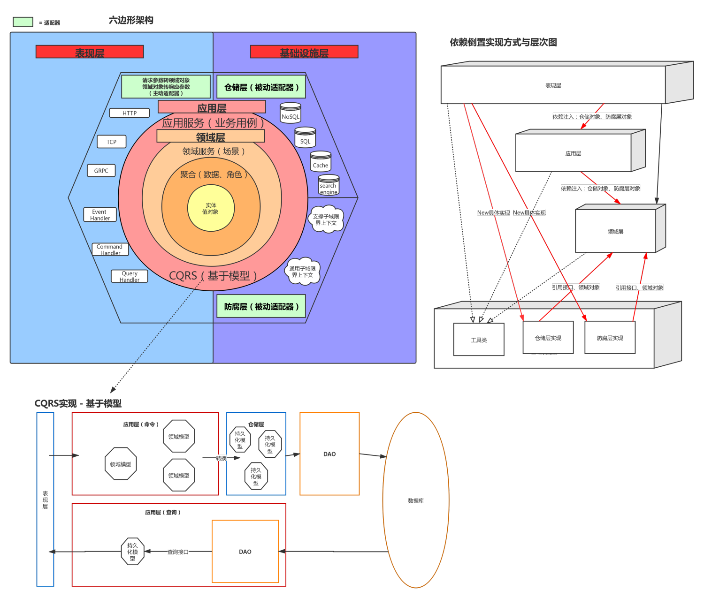
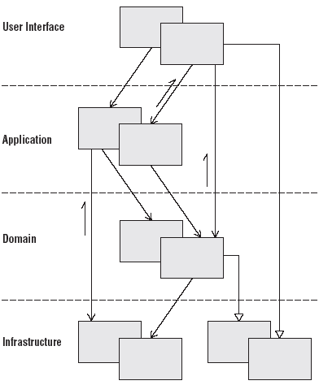
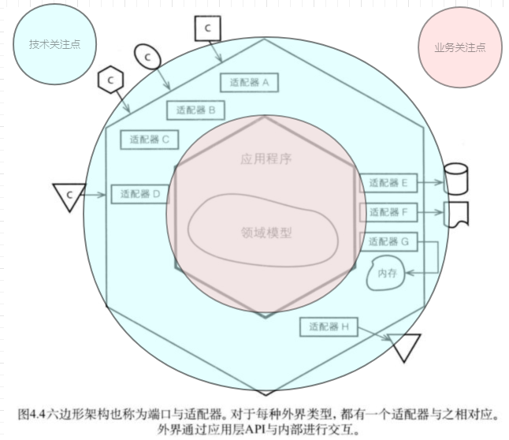
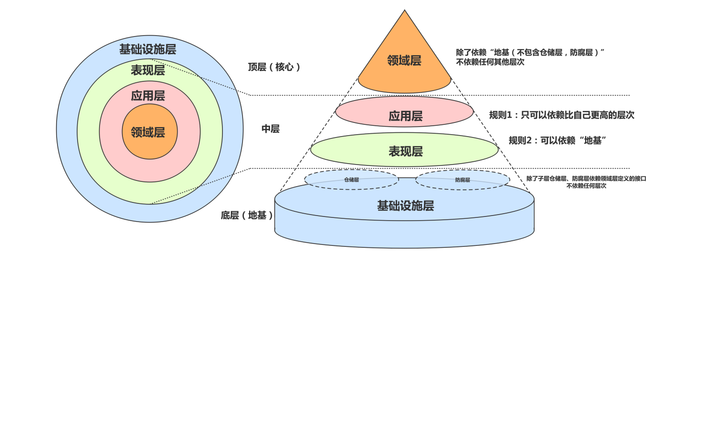
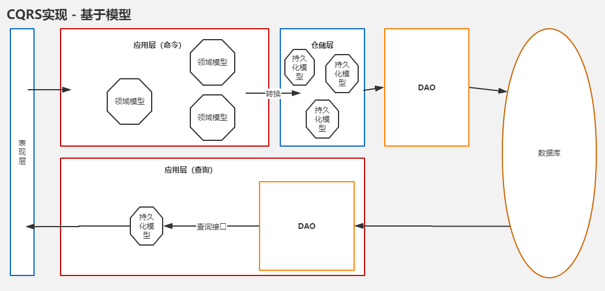

# ddd是什么

## **Domain Driven Design**

领域驱动设计

## UL

UL（Ubiquitous Language，通用语言）是团队共享的语言，是DDD中最具威力的特性之一

## BC

由于UL的重要性，所以需要让每个概念在各自的上下文中是清晰无歧义的，于是DDD在战略设计上提出了模式BC（Bounded Context，限界上下文）

## 优势

| 名称    | 特点                                                         | 优势                                                         |
| ------- | ------------------------------------------------------------ | ------------------------------------------------------------ |
| **POP** | **面向过程编程** 无边界，软件复杂度小适用，例如“盖房子”      | 接触到需求第一步考虑把需求自顶向下分解成一个一个函数。并且在这个过程中考虑分层，模块化等具体的组织方式，从而分解软件的复杂度。当软件的复杂度不是很大，POP也能得到很好的效果。 |
| **OOP** | **面向对象编程** 以“对象”为边界，软件复杂度中适用，例如“盖小区” | 接触到需求第一步考虑把需求分解成一个一个对象，然后每个对象添加一个一个方法和属性，程序通过各种对象之间的调用以及协作，从而实现计算机软件的功能。跟很多工程方法一样，OOP的初衷就是一种处理软件复杂度的设计方法。 |
| **DDD** | **领域驱动设计 **以“问题域”为边界，软件复杂度大适用，例如“盖城市” | 接触到需求第一步考虑把需求分解成一个一个问题域，然后再把每个问题域分解成一个一个对象，程序通过各种问题域之间的调用以及协作，从而实现计算机软件的功能。DDD是解决复杂中大型软件的一套行之有效方式，现已成为主流。 |

## 名词

| 名称               | 解释                                            | 备注                                                         |
| ------------------ | ----------------------------------------------- | ------------------------------------------------------------ |
| DTO                | 层与层直接通讯的数据对象                        | 这里广泛理解为指应用层给表现层定义的专用数据对象             |
| VO                 | View Object，表现层对前端、客户端提供的视图模型 | 可以理解为请求参数                                           |
| DO                 | Domain Object,领域对象                          |                                                              |
| PO                 | Persistent Object，供DAO使用的持久化对象        | ORM定义的数据库模型                                          |
| DAO                | Data Access Object，数据访问服务对象            | 使用ORM封装的访问数据库的基础对象，仓储依赖它来封装          |
| Whole Value Object | 一种模式，等同于DDD中的值对象概念               | `name string`,`age int`,`address string`,这些单纯的值对象组成一个整体值对象`student struct`,日常生活中我们依旧称它为值对象，不强调Whole Value Object这个名词 |
| Full Value Object  | 代表一个实体的全部值对象集合                    | 用于替代业务层级内的DTO对象，同时用于表达一个实体某一时刻的完全状态。 |
| Power Type         | 业务意义比较健壮的独立值对象                    | 常见于各种`ID`概念，如`GameID`,`OrderID`。当一个值对象为基本类型时如`string``int`就应该给他一个强有力的领域概念的身份。如`myGameID string`=>`myGameID GameID` |

## 概念


## 分层

### 表现层presentation

为应用层创建好需要的仓储或者各种工厂，为应用层转换领域概念

### 应用层application

应用层位于技术与业务的边界，外圈是技术，内圈是业务，难免受到一些外部概念的侵蚀。如果需要专注于领域，守护好应用层这一条防线非常重要。所以应用服务的入参与出参都必须是强有力的表达领域概念的值对象，禁止定义各种额外的DTO。

同时引入CQRS架构思想, 命令与查询职责分离。 注：应用层使用command与query是蚂蚁的标准推荐用法，在符合命令与查询职责分离概念的情况下，也可以根据业务个人喜好另外划分。这里只是为了体现相关概念。

**command命令**

```plain
application/command
```

存放有副作用的业务用例。

**query查询**

```plain
application/query
```

存放只跟查询相关的应用服务,该层可以直接调用DAO来获取数据。

**event事件**

```plain
application/event
```

订阅事件、编写事件触发的相关业务操作方法

### 领域层domain

1.**domain/base**定义基础的模型接口，保存多个聚合之间互用的值对象，定义通用的角色接口

2.**domain/service**这里实现多个【不同类型】的聚合对象直接的操作场景，如果需要依赖外部服务，直接定义本包中

3.**domain/{{name}}** 以聚合名称命名的【聚合目录】

**聚合目录{{name}}**

```plain
domain/{{name}}
│  agg.go               //定义聚合接口（这里对应DCI中的D）、聚合角色 （这里对应DCI中的I）
│  agg_acl.go           //定义聚合领域服务所需的防腐层接口
│  agg_repository.go    //定义聚合仓储
│  agg_root.go          //管理聚合根实体接口、聚合根值对象
│  agg_service.go       //实现聚合领域服务(这里对应DCI中的C)
|  agg_specification.go //管理聚合所需要的规格
│  //-↓-以值对象名称命名的文件-↓- 在文件中定义相关的实体接口、值对象
│  channel.go          
│  extra.go
│  role.go
│  sync.go
│  type.go
│  validation_data.go
└─impl                      //聚合的实现
        aggregate.go        //聚合的实现 
        entity_order.go     //entity_名称.go 用来存放实体实现代码
        role_builder.go     //role_角色名称.go 用来存放聚合角色实现代码
        role_verifier.go
```

**doamin根目录下的独立文件**

```plain
doamin/error.go //定义业务错误
domain/event.go //根据基础设施层提供的Event Type定义领域事件
```

## 基础设施层infrastructure

**anticorruption防腐层**

```plain
infrastructure/anticorruption
```

anti-corruption防腐层

这里实现domain/factory/acl.go 中的接口

**repository仓储层**

```plain
infrastructure/repository
```

这里实现domain/factory/repo.go 中的接口

**tools工具集**

```plain
infrastructure/tools
```

这里存放针对本项目实现的非通用类或方法，或者未来会因为本项目的需要特殊定制不考虑封装抽离给外部使用的工具类，如EventBus的封装。

**utils方法集**

```plain
infrastructure/utils
```

存放一些通用的工具，外部项目可以直接copy过去使用的。

# 架构



## 四层架构



## 六边形架构

**在实现技术复杂度与业务复杂度隔离上，引入六边形架构设计**（在基础设施层中添加了仓储层与防腐层概念）



## Clean依赖原则

**项目整体遵循Clean架构提出的依赖规则**

1.依赖方向只能向内圈依赖，内圈对外圈一无所知，内圈不得引用外圈任何对象。

2.外圈使用的数据格式不得让内圈使用，特别是这些数据格式是由外圈使用的框架生成的。

3.扩展：内圈不得为了适应外圈所需的数据格式，而产生没有业务意义或概念的数据对象。本项目拒绝定义任何DTO



## DCI

**为了防止聚合的领域知识过于分散或混乱，同时解决贫血模型问题，引入了DCI架构**

.png)

## CQRS

**为了提高查询效率又引入了基于模型的CQRS架构**



